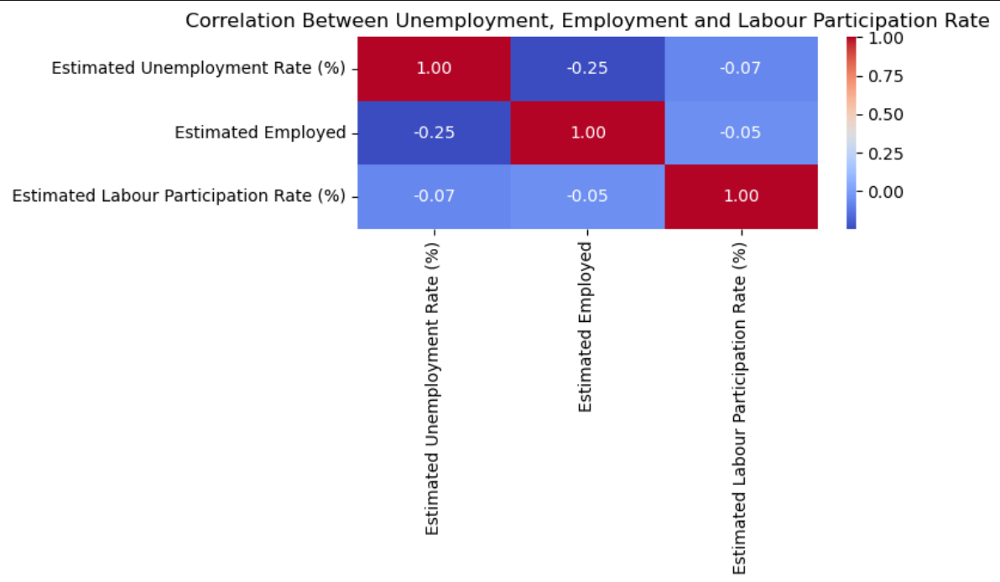
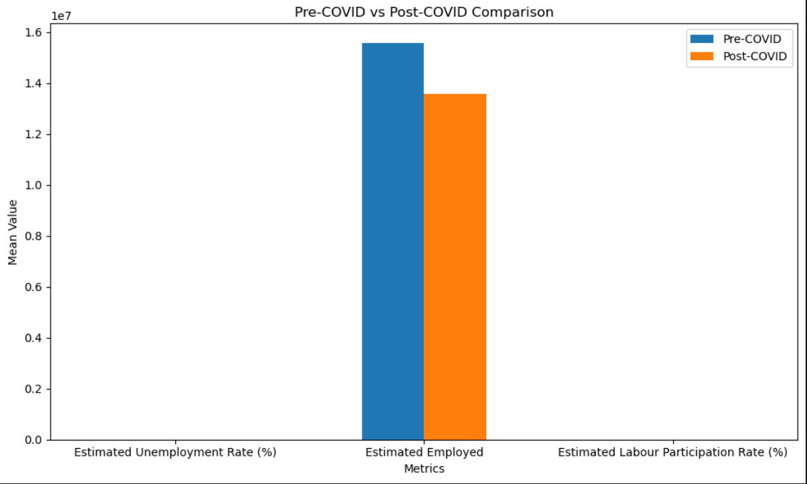
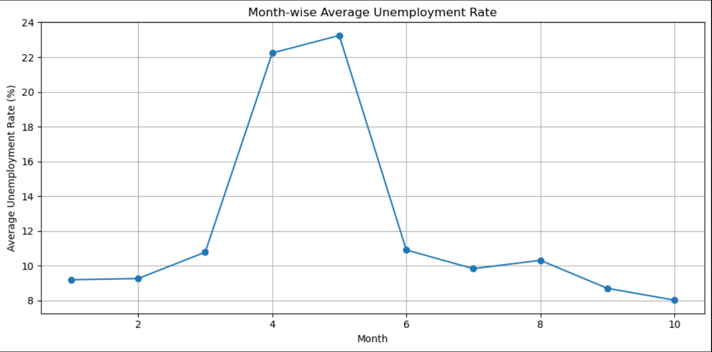
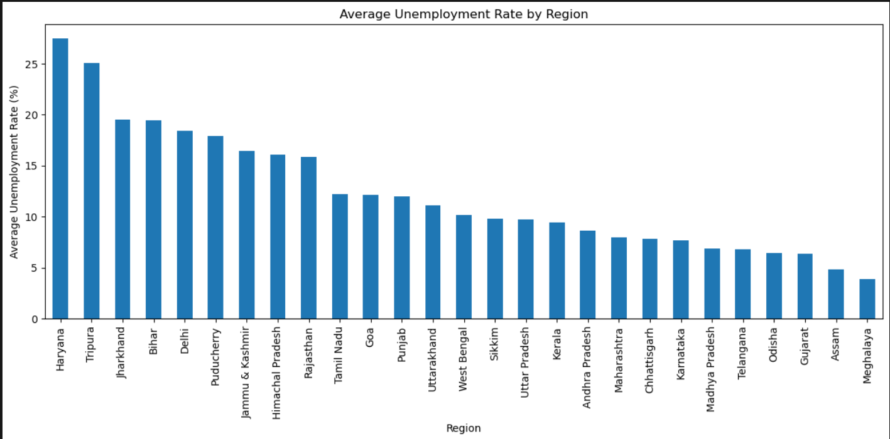
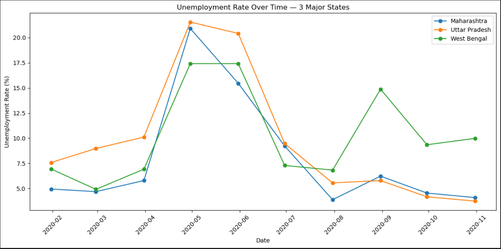
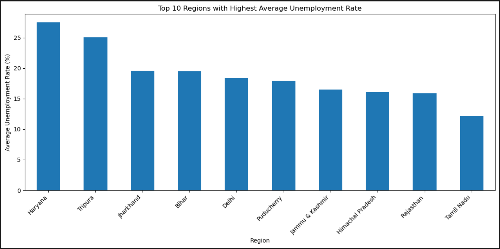

# Data Science Task 2 — Unemployment Analysis With Python

## Dataset

The project uses the **Unemployment in India** dataset containing information about unemployment rate, estimated employment, labour participation rate, region, and date.

## Key Analysis

* Correlation Analysis Between Unemployment Rate, Estimated Employment, and Labour Participation Rate.
* COVID-19 Impact Analysis Using Pre-COVID and Post-COVID Periods.
* Month-Wise Average Unemployment Rate Analysis.
* Region-Wise Average Unemployment Rate Analysis.
* Time-Series Analysis of Maharashtra, Uttar Pradesh, and West Bengal.
* Top 10 Regions With the Highest Average Unemployment Rate.

## Key Findings

* COVID-19 Had a Noticeable Impact on Unemployment and Employment Conditions in India.
* Different Regions Showed Different Unemployment Patterns.
* The Unemployment Rate Varied Considerably Across the Available Months.
* The Correlation Between Unemployment Rate, Estimated Employment, and Labour Participation Rate Was Weak.
* The Top 10 Regions Showed Comparatively Higher Average Unemployment Rates.
* Maharashtra, Uttar Pradesh, and West Bengal Showed Different Unemployment Trends Over Time.

## Objective

The Objective of This Project Is to Perform Exploratory Data Analysis (EDA) on Unemployment Data in India to Identify Regional and Temporal Trends and Understand the Impact of the COVID-19 Pandemic on Unemployment Rates.

## Project Structure

```text
DataScience-Task2-UnemploymentAnalysis/
│
├── screenshots/
│   ├── Correlation_Heatmap.png
│   ├── Covid_Comparison.png
│   ├── Monthly_Trend.png
│   ├── Region_Average.png
│   ├── Time_Series.png
│   └── Top_10_Regions.png
│
├── TASK_2_Unemployment_Analysis.ipynb
├── unemployment.csv
└── README.md
```

## Screenshots

### Correlation Heatmap



### Covid Comparison



### Monthly Trend



### Region Average



### Time Series



### Top 10 Regions



## Technologies Used

* Jupyter Notebook
* Matplotlib
* Pandas
* Python
* Seaborn

## Conclusion

The Analysis Provides a Clear Understanding of Unemployment Trends Across Different Regions and Time Periods in India. The Project Also Highlights Changes Associated With the COVID-19 Period and Demonstrates the Use of Python, Pandas, Matplotlib, and Seaborn for Effective Exploratory Data Analysis.

